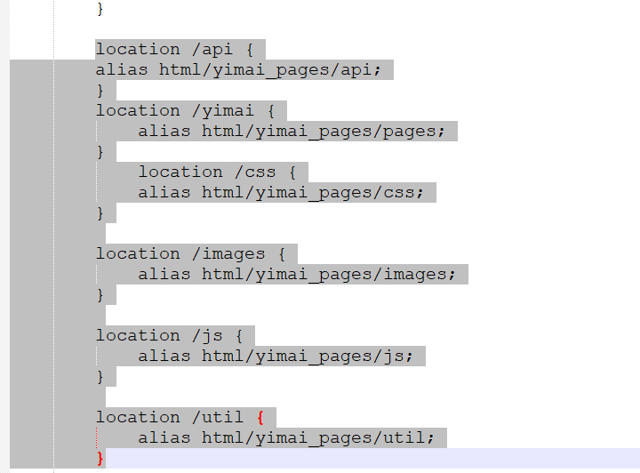
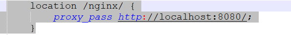

### 文件夹说明:
# pages:存放静态页面
    login:登陆注册页
    index:首页
# js:存放外部js资源
# node_modules:element-ui组件库依赖
# api:存放发起请求的函数
# css:存放css样式表
# utils:工具包
    request.js:二次封装axios

# 修改监听端口号为:5173

# 配置静态资源路径
    
    location /api {
		alias html/yimai_pages/api;
		}
		location /yimai {
			alias html/yimai_pages/pages;
		}
		    location /css {
            alias html/yimai_pages/css;
        }
        
        location /images {
            alias html/yimai_pages/images;
        }
        
        location /js {
            alias html/yimai_pages/js;
        }
        
        location /util {
            alias html/yimai_pages/util;
        }
 # 配置动态资源访问路径(解决跨域)
 
 	location /nginx/ {
			proxy_pass http://localhost:8080/;
		}